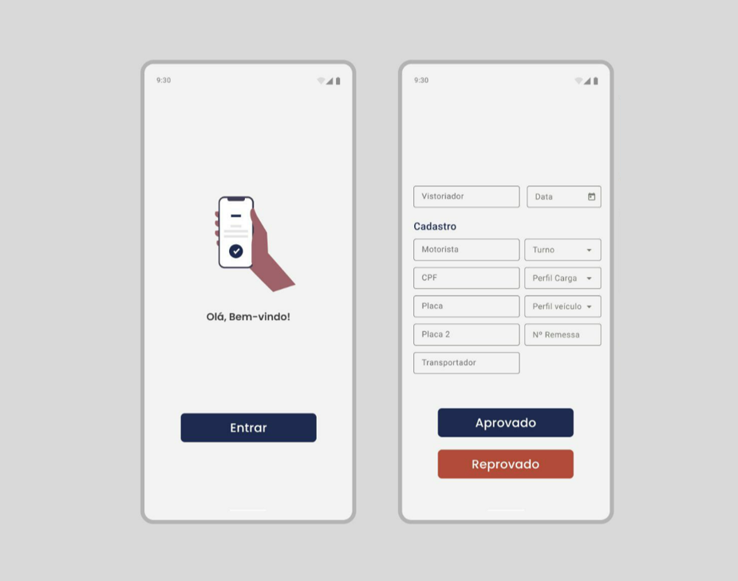
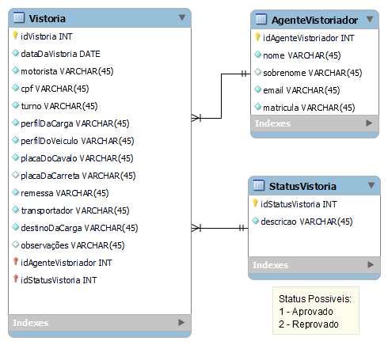

 

  

 

<h2>Descrição do Projeto</h2>

O projeto consiste no desenvolvimento de um aplicativo para a realização das vistorias técnicas de caminhões antes do carregamento.

<h2>Diagrama de Classes</h2>
 

  

<h2>Tecnologias utilizadas</h2>

* Spring Boot framework
* Spring MVC
* Spring Security
* DB H2
* Swagger

<h2>Ferramentas utilizadas</h2>

* Visual Studio Code
* Android Studio
* Figma

<h2>Documentação Swagger</h2>

<a href="http://localhost:8080/swagger-ui/index.html">Link</a> para o Swagger UI.

<h2>Requisitos técnicos do projeto:</h2>

A aplicação deverá permitir, ao usuário devidamente logado, realizar o cadastro do veículo que será carregado, bem como todas as sua informações primárias tais como:

1. Tipo de veículo
2. Placas
3. Motorista
4. Transportadora

Ainda deverão constar informações referentes a carga que será transportada, tais como:

1. Tipo de carga
2. Número da carga, id, protocolo ou remessa
3. Destino